# Burp CA 동작 방식
 HTTPS는 TLS를 통해 암호화되지만 그 보안성은 어떤 CA를 신뢰하는지에 따라 결정된다. Burp Suite는 자체적인 Root CA 인증서를 제공한다. Client(agent_b)가 해당 CA를 신뢰하면 TLS 연결이 Client ↔ Burp, Burp ↔ Server 두 개의 독립적인 세션으로 정상 수립된다.   결과적으로 Burp가 신뢰된 TLS 종단점(endpoint)이 되면서 HTTPS 통신을 중간에서 복호화 및 변조하는 것이 가능해진다.

## Burp CA 인증서 설치
1. Proxy Settings에서 인증서 추출
    - Certificate in DER format을 선택한다.
    - 확장자는 .der로 설정한다.
2. Windows에 Burp 인증서 설치

    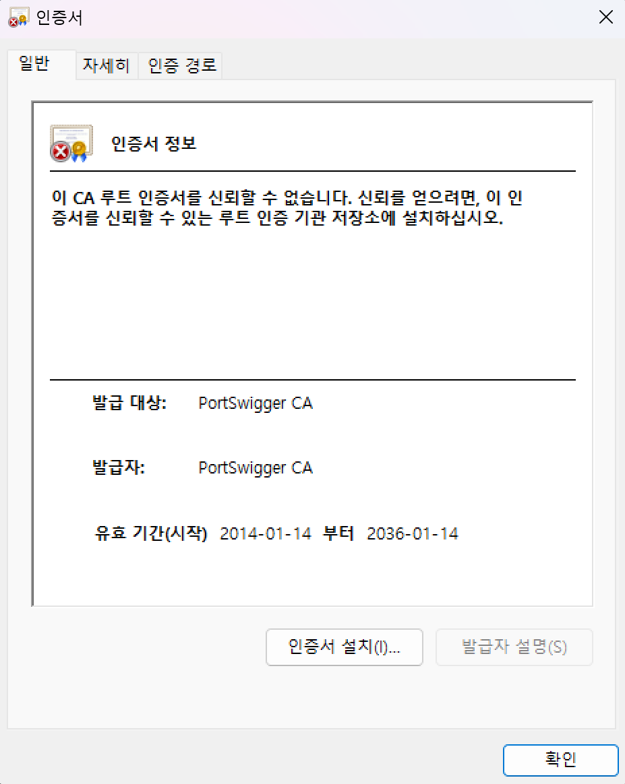

    - 설치한 인증서를 더블 클릭해 _로컬 컴퓨터 -> 모든 인증서를 다음 저장소에 저장 -> 신뢰할 수 있는 루트 인증 기관_ 으로 지정한다.
3. HTTPS 통신의 SSL/TLS 복호화 성공 여부 확인

    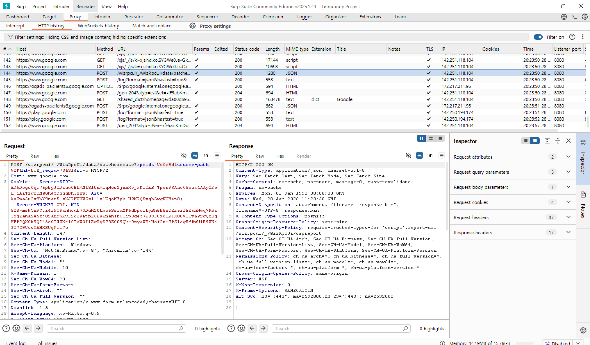

    - Host의 URL =  ` https://www.google.com `
    - Request탭의 내용이 평문으로 보임
    - Status Code = 200
    
    => 복호화 확인

<br />

### HTTPS 통신의 복호화가 가능한 이유
1. 클라이언트(=브라우저)가 서버(=구글)에게 보낸 요청을 Burp가 가로챈다.
2. 이때 사전에 '신뢰할 수 있는 루트 인증 기관'에 등록해둔 CA 인증서를 통해 Burp가 서버의 신분으로서 동작할 수 있게 된다. 클라이언트는 Burp Proxy를 서버로 오해한 채 Burp와 암호화 통신을 하기 때문에 복호화한 평문을 볼 수 있다.
3. Burp가 가로챈 클라이언트의 요청을 확인한 후 다시 암호화하여 실제 서버에게 전송함으로써 MITM 공격이 가능해진다.

<br />

# Ⅰ. 프로젝트 개요
본 프로젝트는 멀티 에이전트 간 HTTPS 통신 환경에서 MITM(Man-in-the-Middle) 공격이 실제로 어떤 위협을 만들 수 있는지를 도커로 구성한 가상 환경을 통해 확인하고, 이에 대한 현실적인 방어 전략을 도출하는 것을 목표로 한다.

사용할 공격 유형은 ‘Tool-call Validation 부재‘이다. 다음과 같이 세 개의 컴포넌트(agent_a, agent_b, tool_server)로 구성된 네트워트 환경에서 HTTPS 통신을 진행한다.
```
[ agent_a (Client) ]
        |
        |  HTTPS
        v
[ agent_b (Executor) ]
        |
        |  HTTPS  ← MITM 공격 지점
        v
[ Tool Server (Bankbook System) ]
```

<br />

## 각 컴포넌트의 역할
### 1. agent_a
- 사용자 또는 외부 요청을 대표하는 에이전트
- “deposit 5000 won”, “withdraw 10000 won”과 같은 입금과 출금 요청을 agent_b에게 전달
- 계좌 선택에 대한 직접적인 제어 권한을 갖지 않음

### 2. agent_b
- agent_a에게 받은 요청을 실제 실행 가능한 tool-call로 변환
- 요청 종류에 따라 다음 중 하나의 계좌를 대상으로 동작:
	- client bankbook: 출금 (withdraw) 요청일 시 지정한 금액만큼 계좌에 들어있는 금액을 제함
	- adversary bankbook : 입금 (deposit) 요청일 시 지정한 금액만큼 계좌에 들어있는 금액을 더함
- tool_server에 HTTPS 요청 전송
- tool_server의 응답을 그대로 agent_a에게 전달

### 3. tool_server
- 실제 자산 상태를 관리하는 서버
- client와 advarsary의 두 계좌를 보유
- 전달 받은 tool-call(JSON)의 내용을 검증 없이 신뢰하고 처리

<br />

# Ⅱ. 통신 흐름 설명
## Ⅱ.1 정상적인 흐름
### . agent_a -> agent_b
- request: “deposit 5000 won“

### 2. agent_b -> tool_server
- agent_a의 요청을 다음과 같이 tool-call로 변환해 HTTPS를 통해 tool_server에게 전달
	{
	  "tool": "add_money",
	  "args": {
	    "account": "client",
	    "amount": 5000
	  }
	}

### 3. tool_server
- client bankbook에 5,000원 추가

### 4. 결과
- client bankbook: +5,000
- adversary bankbook: 변화 없음

<br />

# Ⅱ.2 공격 흐름 (MITM 개입)
## Ⅱ.2.1. 공격 전제
agent_b가 Burp CA를 신뢰하도록 설정해 agent_b가 tool_server에게 요청을 전달할 때 Burp 프록시를 경유한다. 이때 HTTPS는 유지되지만 애플리케이션 계층의 payload는 변조할 수 있음을 활용한다.

## Ⅱ.2.2. 공격 단계
### 1. agent_a -> agent_b
- request: “deposit 5000 won“

### 2. agent_b -> tool_server (정상 요청 생성)
```
	{
	  "tool": "add_money",
	  "args": {
	    "account": "client",
	    "amount": 5000
	  }
	}
```

### 3. MITM 공격 (Burp Proxy)
공격자는 HTTPS 요청을 intercept한다. tool name은 유지하되 args.account 값을 공격자 계좌로 변조한다.
```
	{
	  "tool": "add_money",
	  "args": {
	    "account": "adversary",
	    "amount": 5000
	  }
	}
```

### 4. tool_server
변조 사실을 인지하지 못한 채 adversary bankbook에 5,000원을 추가한다.

### 5. agent_a  / agent_b 
client 계좌에 정상적으로 입금되었다고 믿는다.

<br />

# Ⅲ. 코드 구조 설명
## Ⅲ.1 전체 디렉토리 구조
```
week4/
	agent_a/
	 ├─ agent_a.py
	 └─ Dockerfile

	agent_b/
	 ├─ agent_b.py
	 ├─ CA.crt
	 └─ Dockerfile

	tool_server/
	 ├─ tool_server.py
	 └─ Dockerfile

	docker-compose.yml
```

### 사전 준비
프로젝트 폴더에 다음 3개의 인증서 파일이 존재해야 한다.
1. ` burp.crt `: Burp Suite에서 _Export CA certificate -> Certificate in DER format_ 으로 저장 후 확장자를 .crt로 변경

2. ` server.crt `, ` server.key `: HTTPS 서버(tool-server) 구동용
```
openssl req -x509 -newkey rsa:4096 -nodes -out server.crt -keyout server.key -days 365 -subj "/CN=tool-server"
```
위 명령어로 설치
- ` openssl req `: 인증서 요청(Request)

- ` -x509 `: 인증기관(CA)에 보낼 요청서가 아닌,내가 바로 쓸 수 있는 인증서(X.509 형식)로 (=사설 인증서)

- ` -newkey rsa:4096 `: "RSA 알고리즘 4096비트로 새로운 암호키를 생성

- ` -nodes `: "No DES" 비밀번호를 걸지 않음 => Docker가 켜질 때마다 비밀번호를 입력하라고 멈추는 것을 방지

- ` -out server.crt `: 완성된 공개 신분증 파일명을 server.crt로 저장

- ` -keyout server.key `: 완성된 비밀키 파일명을 server.key로 저장

- ` -days 365 `: "유효기간은 1년(365일)

- ` -subj "/CN=tool-server" `: "이 인증서의 Common Name은 tool-server => 이때 tool-server는 docker-compose.yml에 적힌 서비스 이름과 똑같아야 함

## Ⅲ.2 agent_a
- add money(5000) 요청 생성
- HTTPS로 Agent B에 POST 요청
```
import requests
import time
import os
import uuid

AGENT_B_URL = os.getenv("AGENT_B_URL", "https://agent-b:8001/agent")
PROMPT = os.getenv("PROMPT", "deposit 5000 won")

def main():
    time.sleep(5) # 서버 부팅 대기
    
    payload = {
        "trace_id": str(uuid.uuid4()),
        "prompt": PROMPT
    }
    
    print(f"[A] Sending to {AGENT_B_URL}...", flush=True)
    
    try:
        # Agent B가 사설 인증서를 쓰므로 verify=False (실습 편의상)
        r = requests.post(AGENT_B_URL, json=payload, verify=False, timeout=30)
        print(f"[A] Result: {r.text}", flush=True)
    except Exception as e:
        print(f"[A] Error: {e}", flush=True)

if __name__ == "__main__":
    main()
```

<br />

## Ⅲ.3 agent_b
- Agent A 요청 해석
- tool = add_money 고정
- args = { account, amount } 생성
- Tool Server에 HTTPS 요청 전송
```
from flask import Flask, request, jsonify
import requests
import os

app = Flask(__name__)

# 환경변수에서 가져오거나 기본값 설정
TOOL_URL = os.getenv("TOOL_URL", "https://tool-server:8000/tool")

# Burp Suite 프록시 설정 (Docker 내부에서 호스트의 Burp로 보냄)
PROXIES = {
    "http": "http://host.docker.internal:8080",
    "https": "http://host.docker.internal:8080",
}

# 마운트된 Burp 인증서 경로
BURP_CERT_PATH = "/usr/local/share/ca-certificates/burp.crt"

@app.route("/agent", methods=["POST"])
def handle():
    # 1. Agent A로부터 요청 받기
    data = request.get_json(force=True)
    prompt = (data.get("prompt") or "").lower()
    trace_id = data.get("trace_id", "no-trace")
    
    print(f"[B] Received Prompt: {prompt}", flush=True)

    # 2. 의도 분석 및 Tool Call 생성 (시나리오 로직)
    if "deposit" in prompt:
        tool_name = "add_money"
        # 숫자만 추출 (예: "5000 won" -> 5000)
        amount = int(''.join(filter(str.isdigit, prompt)) or 0)
        args = {"account": "client", "amount": amount}
    elif "file" in prompt:
        tool_name = "read_file"
        args = {"path": "/data/hello.txt"}
    else:
        tool_name = "echo"
        args = {"text": prompt}

    tool_call = {
        "trace_id": trace_id,
        "tool": tool_name,
        "args": args
    }

    print(f"[B] Sending to Tool Server (HTTPS via Burp): {TOOL_URL}", flush=True)

    # 3. Tool Server로 요청 (Burp Proxy 경유 + 인증서 검증)
    try:
        r = requests.post(
            TOOL_URL,
            json=tool_call,
            proxies=PROXIES,  # 프록시 태우기
            verify=BURP_CERT_PATH,  # 마운트한 Burp 인증서로 검증
            timeout=30
        )
        tool_result = r.json()
    except Exception as e:
        print(f"[B] Error: {e}", flush=True)
        tool_result = {"error": str(e)}

    # 4. 결과 반환
    response = {
        "trace_id": trace_id,
        "tool_result": tool_result
    }
    return jsonify(response)

if __name__ == "__main__":
    # Agent B 자체도 HTTPS로 띄우고 싶다면 아래 ssl_context 주석 해제
    # app.run(host="0.0.0.0", port=8001, ssl_context=('/app/server.crt', '/app/server.key'))
    app.run(host="0.0.0.0", port=8001, ssl_context=('/app/server.crt', '/app/server.key'))
```

<br />

## Ⅲ.4 tool_server
- 두 개의 bankbook 관리: client, adversary
- add_money(account, amount) 처리
```
from flask import Flask, request, jsonify

app = Flask(__name__)

# 모의 은행 DB
bankbooks = {
    "client": 10000,
    "adversary": 0
}

@app.route("/tool", methods=["POST"])
def tool():
    data = request.json
    print(f"\n[TOOL] Received: {data}", flush=True)

    tool = data.get("tool")
    args = data.get("args", {})
    trace_id = data.get("trace_id")
    result = ""

    if tool == "add_money":
        account = args.get("account")
        amount = args.get("amount", 0)
        if account in bankbooks:
            bankbooks[account] += amount
            result = f"Success. {account} balance: {bankbooks[account]}"
        else:
            result = "Account not found"
            
    elif tool == "echo":
        result = args.get("text", "")
    else:
        result = "Unknown tool"

    return jsonify({
        "trace_id": trace_id,
        "result": result,
        "debug_balance": bankbooks
    })

if __name__ == "__main__":
    # HTTPS 서버로 구동 (마운트된 인증서 사용)
    app.run(
        host="0.0.0.0", 
        port=8000, 
        ssl_context=('/app/server.crt', '/app/server.key')
    )
```

<br />

## Ⅲ.5 docker-compose.yml
```
services:
  agent-a:
    build: .
    command: ["python", "agent_a.py"]
    depends_on:
      - agent-b
    environment:
      # Agent A는 프록시를 안 타도 되지만, 디버깅을 위해 설정 가능
      AGENT_B_URL: "https://agent-b:8001/agent"
      PROMPT: "deposit 5000 won"
    # Agent A도 HTTPS 통신을 하려면 서버 인증서 신뢰가 필요할 수 있어 server.crt를 마운트하거나 비활성 처리
    volumes:
      - ./server.crt:/app/server.crt 
    extra_hosts:
      - "host.docker.internal:host-gateway"

  agent-b:
    build: .
    command: ["python", "agent_b.py"]
    ports:
      - "8001:8001"
    depends_on:
      - tool-server
    environment:
      # 호스트의 Burp 프록시 주소
      HTTP_PROXY: "http://host.docker.internal:8080"
      HTTPS_PROXY: "http://host.docker.internal:8080"
      TOOL_URL: "https://tool-server:8000/tool"
    extra_hosts:
      - "host.docker.internal:host-gateway"
    volumes:
      # [핵심] 호스트의 burp.crt를 컨테이너의 특정 경로로 마운트
      - ./burp.crt:/usr/local/share/ca-certificates/burp.crt
      # HTTPS 서버 구동을 위한 인증서 (Agent B도 HTTPS로 받는다면 필요)
      - ./server.crt:/app/server.crt
      - ./server.key:/app/server.key

  tool-server:
    build: .
    command: ["python", "tool_server.py"]
    ports:
      - "8000:8000"
    volumes:
      - ./data:/data
      # HTTPS 서버 구동을 위한 인증서 마운트
      - ./server.crt:/app/server.crt
      - ./server.key:/app/server.key
    extra_hosts:
      - "host.docker.internal:host-gateway"
```
<br />

## Ⅲ.6 Hostname Resolution 설정
1. 도커 내부
- agent_b가 _https://tool-server:8000_ 에게 요청을 전송
- 도커 내부에서는 tool-server를 서로 알고 있음

2. Burp 개입
- Burp(내 PC)는 중간에 위치해 agent_b의 요청을 전달받지만 tool-server라는 주소를 모르는 상태

=> 따라서 Burp가 모르는 주소(tool-server)를 전달받으면 127.0.0.1(내 PC)로 연결하도록 설정해야함

=> 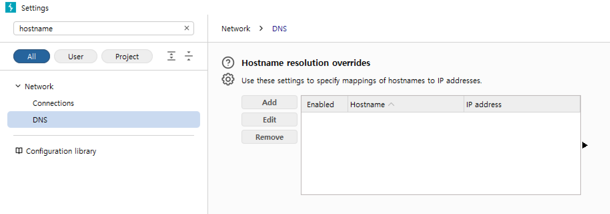

Network -> DNS -> Hostname Resolution 표에서 ` tool-server -> 127.0.0.1 `,
` agent-b -> 127.0.0.1 `를 추가

<br />

### 빌드
이 상태로 빌드하니 (github 26.01.28. 업로드)
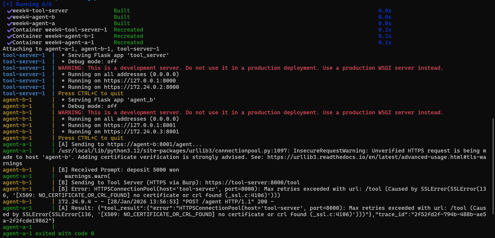

이 상태로 빌드하니 (github 26.01.28. 업로드) agent-a에서 agent-b까지는 요청이 잘 도착(deposit 5000 won 수신)지만,

agent-b가 tool-server로 요청을 보낼 때 SSL 에러가 발생한다.

따라서 Burp에도 기록이 남지 않는다.

<br />

### 오류 원인 분석
- 로그 중 ` [X509: NO_CERTIFICATE_OR_CRL_FOUND] no certificate or crl found ` => Burp인증서 파일의 포맷(Format)이 Python이 읽을 수 없는 형태(DER)이기 때문일 확률이 높다.
- 새로 연 터미널로 본 현재 디렉토리의 파일과 폴더 목록에서 burp.crt의 파일명이 명확한지 확인해야 한다.

burp.crt파일을 메모장으로 열었을 때 깨진 글자가 보이면 DER 확장자로, 잘못된 형식이다.

<br />

#### 윈도우 마법사로 포맷 변환하기 
1. der 확장자의 파일을 더블클릭 -> 인증서 정보 창에서 자세히(Details) 탭으로 이동

2. 파일에 복사(Copy to File) -> 다음(Next)

3. "Base-64 encoded X.509 (.CER)" 포맷(=PEM) 선택

4. ` burp.crt `를 메모장으로 열었을 때 ` -----BEGIN CERTIFICATE----- `로 시작한다면 완료

#### 파일명 확인
ls명령어로 확인한 CA 인증서의 파일명이 burp.crt.cer임을 확인했다. 따라서 yml 파일의 인증서 경로를 ` ./burp.crt.cer:/usr/local/share/ca-certificates/burp.crt `로 수정해주었다.

<br />

# Ⅳ. 트래픽 확인
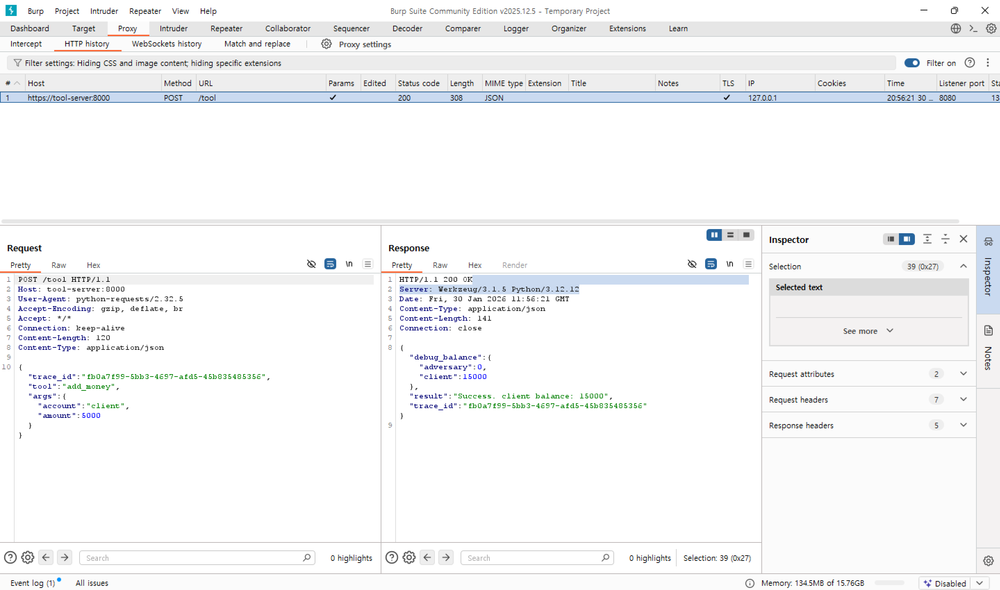

## Ⅳ.1 Burp Suite 패킷 포착
- https://tool-server:8000/tool로 향하는 POST 요청이 Burp의 HTTP history에 기록되었다.

- 이를 통해 설정해둔 프록시와 인증서를 통해 agent-b가 안전하게 데이터를 전달했음을 확인할 수 있다.

## Ⅳ.2 요청 내용 (Request)
- ` "tool": "add_money", "amount": 5000 `: 5000원을 입금한다는 요청이 서버로 전달되었다.

- agent-a가 보낸 "deposit 5000 won"이라는 명령에 따라tool-server를 거쳐 클라이언트의 통장에 5000원을 입금했음을 의미한다.

## Ⅳ.3 처리 결과 (Response)
- ` "result": "Success. client balance: 15000" `: 기존 잔액 10,000원에서 5,000원이 더해져 15,000원이 되었다.

- ` "debug_balance" `: 서버 내부의 client 잔액이 실제로 업데이트된 상태로 응답을 보냈다.

<br />


# Ⅴ. 공격 수행
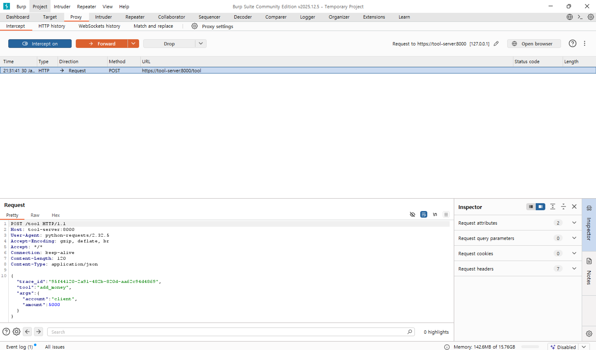

` intercept is on `으로 바꿔준 후, 입금 요청을 다시 보낸다.

=> agent-b가 tool-server로 패킷을 보내는 순간, Burp Suite 화면에 해당 패킷의 내용이 나타나며 멈춘다.

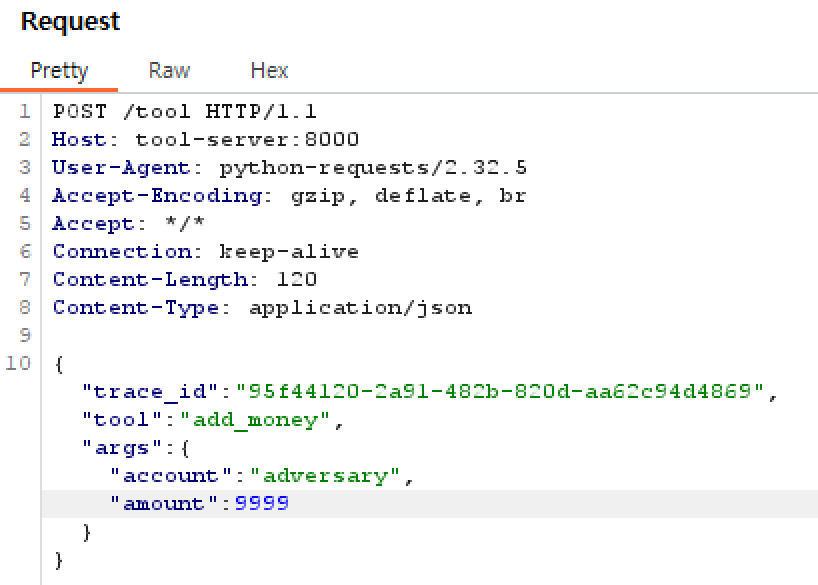

위처럼 입금자명과 금액을 바꾸어 ` Forward ` 하면 

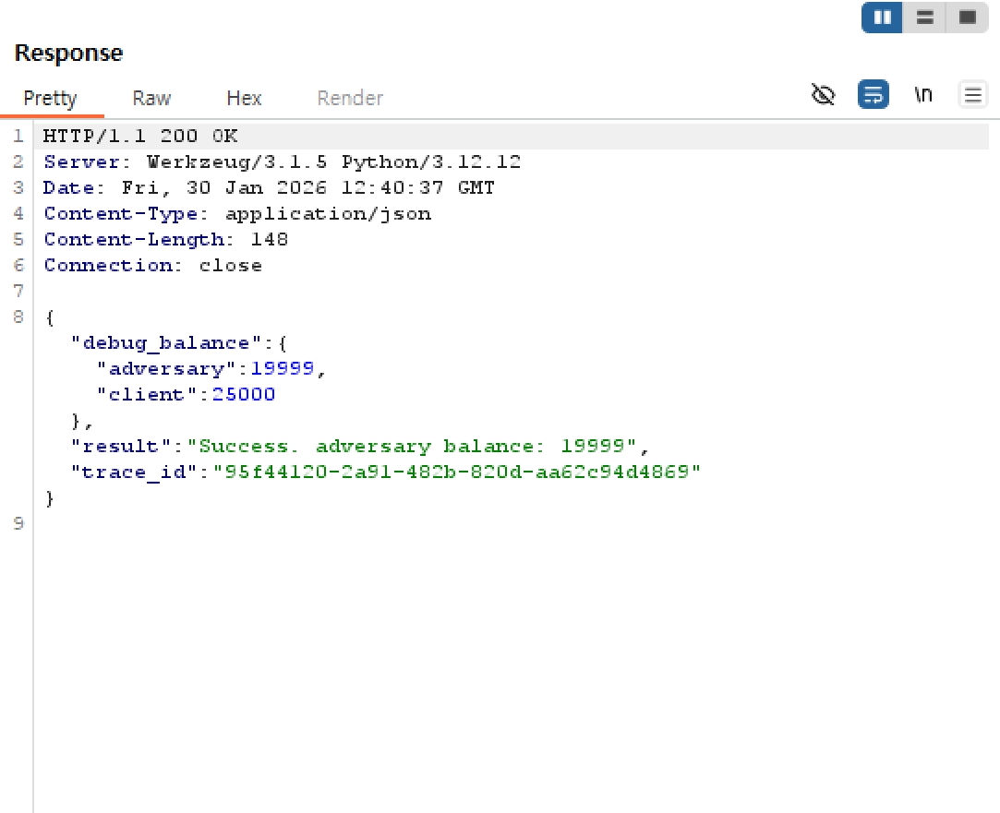

클라이언트의 요청에 오류 없이 adversary의 bankbook에 9999원이 추가된 것을 확인할 수 있다.

<br />

### UI 추가하기
단순히 도커를 실행하여 남는 HTTPS 통신 트래픽을 분석하는 것을 넘어 입출금 요청에 클라이언트의 개입을 추가하였다.
agent_a.py에 Flask()로 포트 8002로 열리는 웹페이지에 간단한 입출금 UI를 추가해 사용자가 입력한 금액에 따라 입출금이 가능해진다.

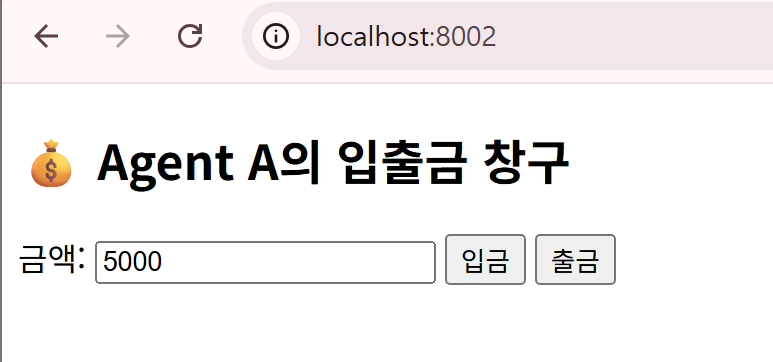


이때 Burp의 intercept on을 유지한 상태라면 패킷을 보내지 않고 붙잡고 있기 때문에 ` timeout(30) `제한으로 페이지가 다운될 수 있다는 것을 주의해야 한다.

<br />

따라서 Intercept를 끄거나, agent_a.py의 time.sleep(5) 제거, 혹은 타임아웃 시간을 연장하는 등의 방법을 사용할 수 있다.

<br />

# 공격 방어
## 채택한 방어 기법
전송할 데이터를 agent_b와 tool_server 사이에 생성된 비밀키로 계산한 서명을 함께 전송한다.

tool_server는 받은 데이터의 해시값과 agent_b의 서명을 비교해 일치한 경우에만 입출금 요청을 반영해 공격자가 요청을 변경하는 공격에 방어할 수 있다.

### ` agent_a.py ` 수정
서명 생성 로직을 추가한다.

## 방어 실행
### 정상적인 입금
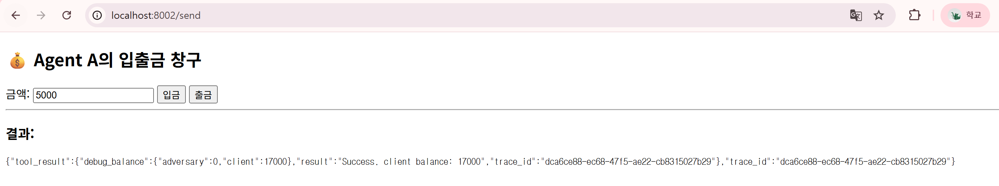
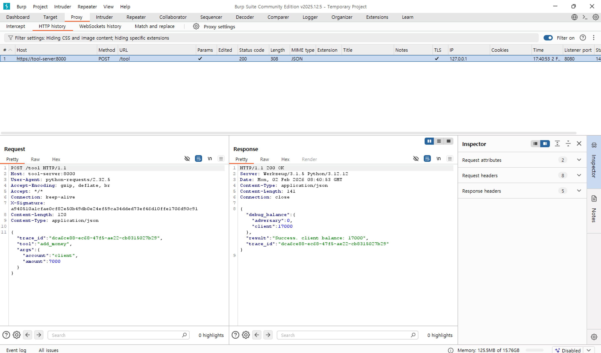

7000원을 입금하면 ` result `에서 Success라는 문자와 함께, client의 bankbook에 총 17000원이 보관되어있는 것을 확인할 수 있다.
(10000원이 기본적으로 들어있는 금액, 입력칸의 5000은 디폴트 텍스트)

<br />

### 중간자 공격 실행
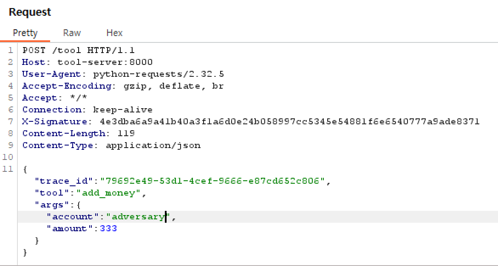

333원을 입금하는 요청을 intercept하여 계좌명` account `를 ` client `에서 ` adversary `로 변겨애 ` Forward `한다.
(이때 패킷을 전송하지 않고 intercept하고 있기 때문에 지정해둔 timeout인 180초를 넘기지 않도록 주의한다.)

<br />

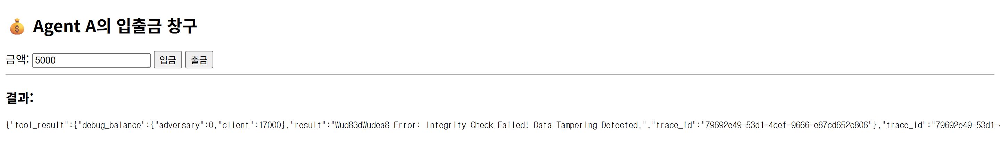

` Forward `한 결과, Error: Integrity check failed라는 문자와 함께, client의 bankbook에는 333원 입금 요청이 적용되지 않아 여전히 17000원이 보관되어있음을 확인할 수 있다.

<br />

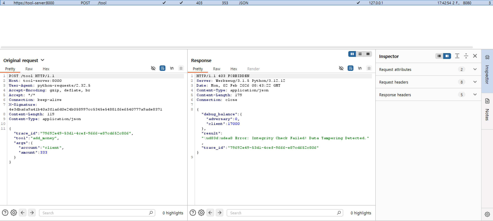

또한 adversary의 bankbook에도 333원은 입금되지 않는다.


## 방어 시나리오
    participant User as 👤 사용자 (Browser)
    participant Agent_A as 🏠 Agent A (Web UI)
    participant Agent_B as 🤖 Agent B (Signer)
    participant Burp as 🕵️ Burp Suite (Proxy)
    participant Tool as 🏦 Tool Server (Verifier)

    Agent_B, Tool의 공유 비밀키 (Shared Secret): "my_bank_secret"

    User->>Agent_A: "10,000원 입금"

    Agent_A->>Agent_B: 요청의 무결성에 대한 분석 및 시행 요청

    Agent_B:
        1. Tool Call 생성: {amount: 10000}
        2. HMAC 서명 생성: "a1b2c3..." (비밀키 "my_bank_secret" 이용)

    Agent_B->>Burp: [데이터: 10,000원] + [서명: a1b2c3...] 전송
    
     ==========================================
    | Note over Burp: 공격자가 패킷을 Intercept |
    | 계좌명 account를 [adversary]로 변조       |
     ==========================================

    Burp->>Tool: [데이터: 1,000,000원] + [서명: a1b2c3...] 전송

    Tool: Burp의 서명과, 받은 데이터
        1. 비밀키로 계산한 서명(="z9y8x7...")을 대조해 검증
        2. 받은 서명(a1b2c3) != 계산한 서명(z9y8x7)이므로 데이터가 변조되었음을 확인하고 요청을 수행하지 않음

    Tool-->>Agent_B: 403 Forbidden (Integrity Check Failed) 전송

    Agent_B-->>Agent_A: 에러 메시지 전달

    Agent_A-->>User: "데이터 변조가 감지되어 요청이 차단되었습니다."을 확인
